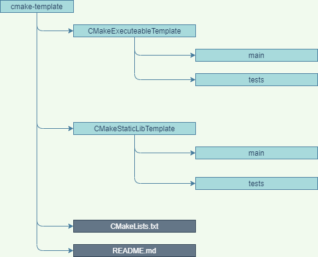

# 1. CMake-Template

- [1. CMake-Template](#1-cmake-template)
  - [1.1. Description](#11-description)
  - [1.2. Project structur](#12-project-structur)
  - [1.3. Needed tools](#13-needed-tools)
    - [1.3.1. Install GTest](#131-install-gtest)
  - [1.4. Start Development](#14-start-development)
  - [1.5. IDE](#15-ide)
  - [1.6. Git Workflow](#16-git-workflow)
  - [1.8. LICENSE](#18-license)

## 1.1. Description

A simple cmake c++ program template.

## 1.2. Project structur



## 1.3. Needed tools

- CMake
- Make
- C++ compiler
- GTest (https://github.com/google/googletest.git)

### 1.3.1. Install GTest

- checkout this repo "https://github.com/google/googletest.git" and install all with cmake

```bash
    git clone https://github.com/google/googletest.git
    cd googletest
    cmake .
    make install
```

- install this lib with following command "sudo apt-get install libgtest-dev"

```bash
    sudo apt-get install libgtest-dev
    sudo apt-get install cmake
    cd /usr/src/gtest
    sudo cmake CMakeLists.txt
    sudo make

    # copy or symlink libgtest.a and libgtest_main.a to your /usr/lib folder
    sudo cp *.a /usr/lib
```

## 1.4. Start Development

Checkout this project

```bash
    git clone git@github.com:grobbles/qt-cmake-template.git
    cd qt-cmake-template
```

Run the main script to initialize the project

```bash
     ./run.sh -i
```

To build the project run the scpript with following command

```bash
     ./run.sh -b
```

Execute the program

```bash
     ./run.sh -s
```

## 1.5. IDE

The qt cmake template project is optimized for:

- visual studio code IDE.
- qt creator

## 1.6. Git Workflow

- master branch
- feature branch
- bugfix branch

If you want to add a new feature than create a new branch from master branch and commit your stuff to the branch. If you think you are done than create a merge request.

## 1.8. LICENSE

MIT License
